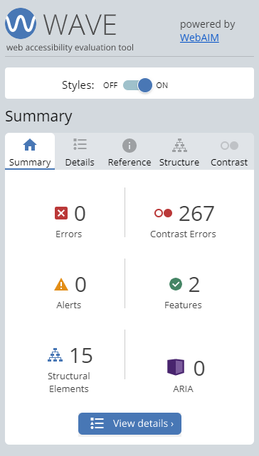

# stackline-code-test
Coding assessment from Stackline
Demo: [https://www.petewetzel.com/stackline/](https://www.petewetzel.com/stackline/)

### Problem Description
Implement a solution that meets the following criteria:
1. A solution that resembles the provided mock up closely and implements AT LEAST ONE of either the graph or chart as seen in the mock up
2. A working solution that takes the provided JSON file as output from a stubbed-out API call
3. A solution that implements React and Redux best practices and patterns
4. Clean code

### View Live Demo
View the generated code at [petewetzel.com/stackline/](https://www.petewetzel.com/stackline/)

## Features
1. Responsive Design
2. Accessibility via Wave Tool https://wave.webaim.org/

### Available Scripts

In the project directory, you can run:

#### `npm start`

Runs the app in the development mode. 
Open [http://localhost:3000](http://localhost:3000) to view it in the browser.

The page will reload if you make edits. 
You will also see any lint errors in the console.

#### `npm test`

Launches the test runner in the interactive watch mode. 
See the section about [running tests](https://facebook.github.io/create-react-app/docs/running-tests) for more information.

#### `npm run build`

Builds the app for production to the `build` folder. 
It correctly bundles React in production mode and optimizes the build for the best performance.

The build is minified and the filenames include the hashes. 
Your app is ready to be deployed!

See the section about [deployment](https://facebook.github.io/create-react-app/docs/deployment) for more information.

### To Do
- [ ] Sorting on the data table (just noticed that)
- [ ] Format the Graph utility to more closely model the image or write own graphing utility
- [ ] Add static type checking (https://flow.org/en/)

This project was bootstrapped with [Create React App](https://github.com/facebook/create-react-app).
